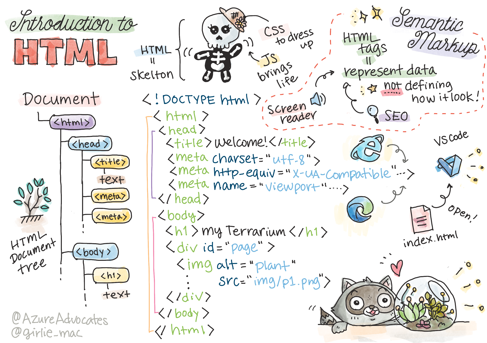
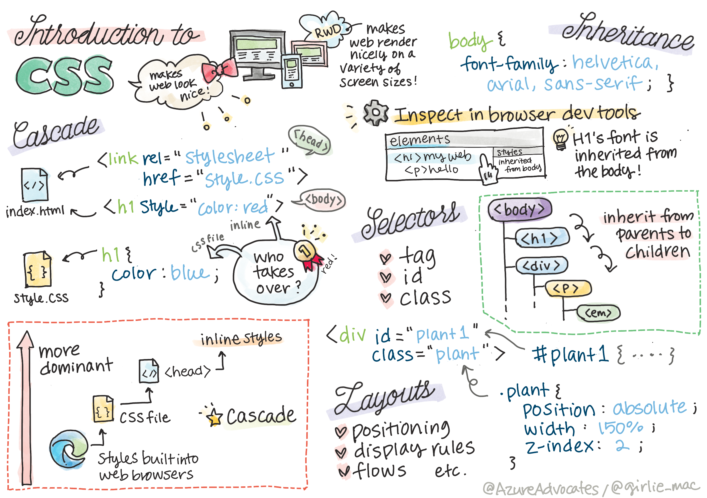
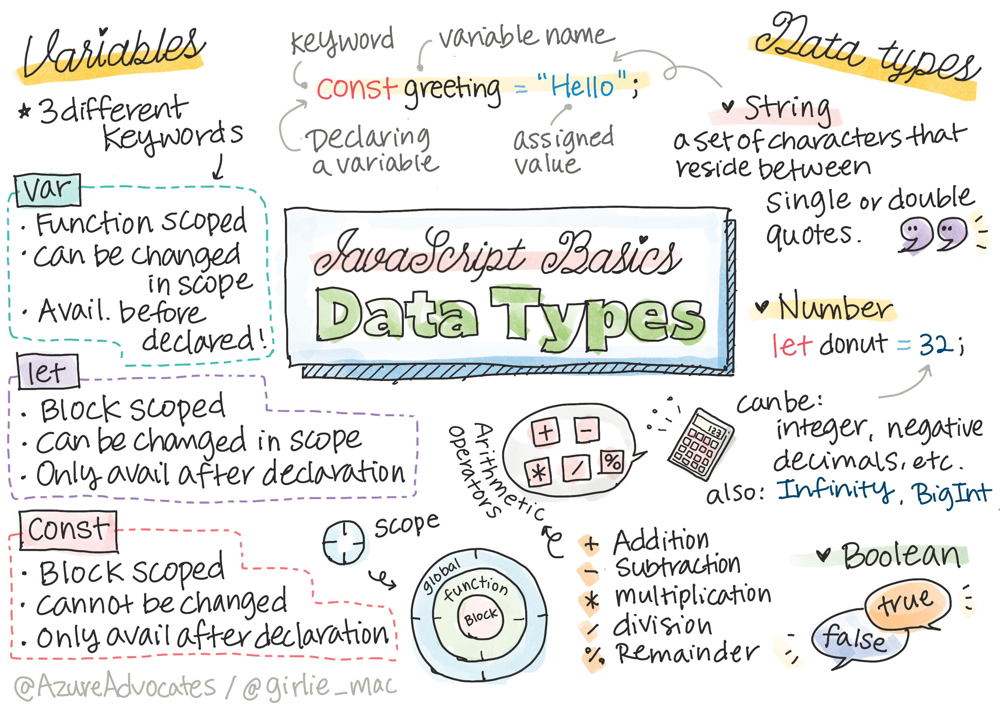
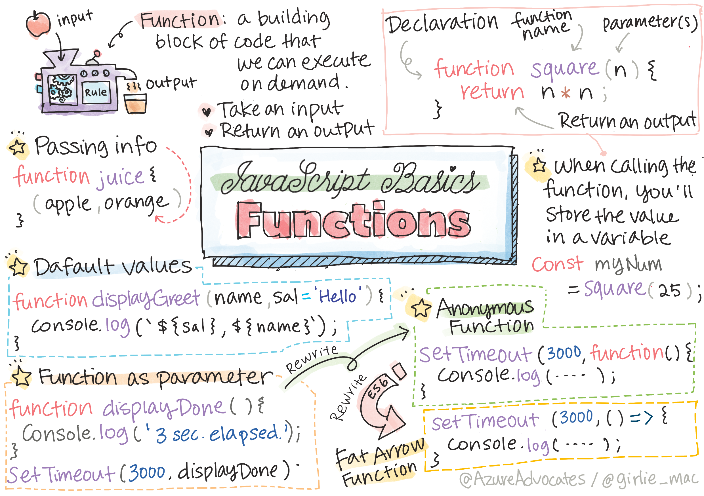
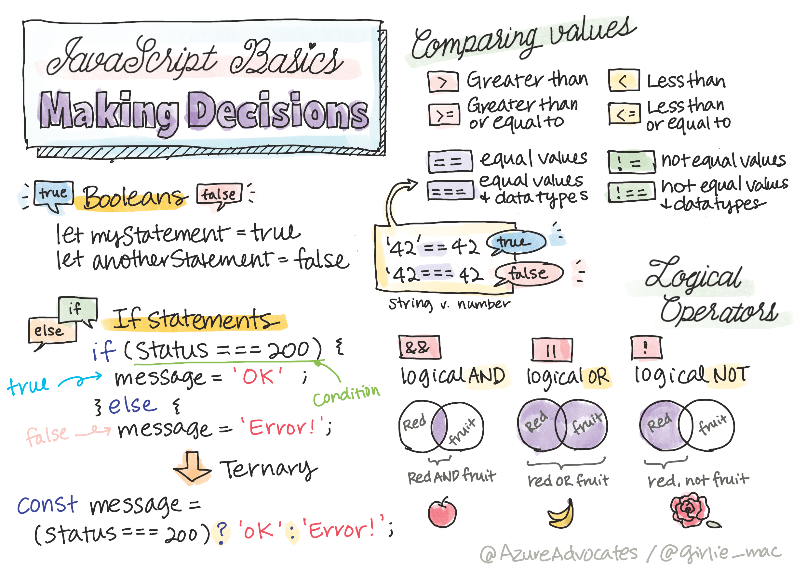
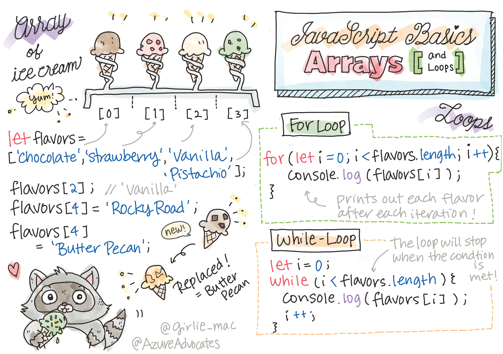
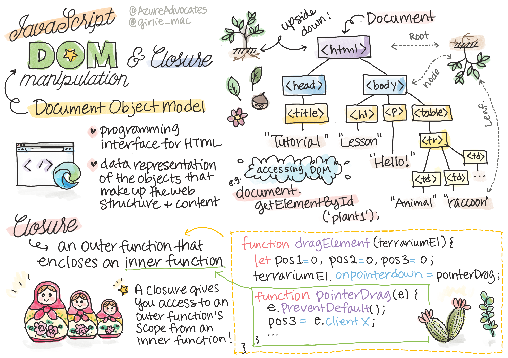

# Overview
This repository is for storing all my web development learning procecss, I used two main resources for this, one is an online courses and the other from Microsoft web development course.

# HTML


# CSS


# Javascript:

## Data Types


## Functions


## Conditionals


## Arrays and Loops

```javascript
let iceCreamFlavors = ["Chocolate", "Strawberry", "Vanilla", "Pistachio", "Rocky Road"];

for (let i = 0; i < iceCreamFlavors.length; i++) {
  console.log(iceCreamFlavors[i]);
} 
```

## Document Object Model (DOM)



